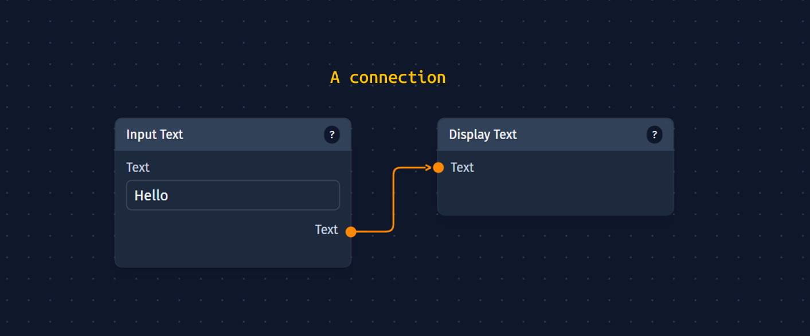
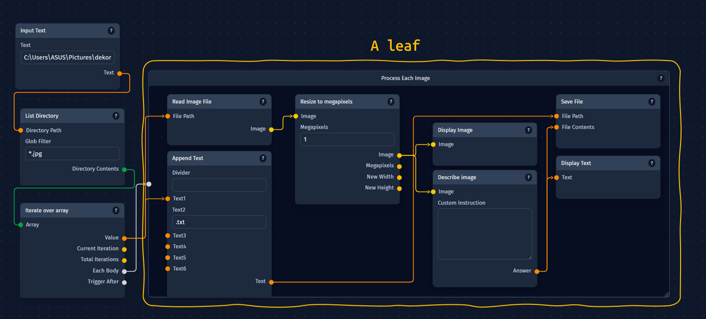

---
title: Understanding CozyUI - Core Concepts
---

# Understanding CozyUI: Core Concepts

Let us help you understand the basic ideas behind how CozyUI works, even if you're not a technical expert. Think of CozyUI as a visual way to build automated assistants or mini-programs that can perform tasks for you.

:::tip
Are you a developer? You might be interested in [Core Concepts in the Developers' Guide](/developers/core-concepts)
:::

## What is CozyUI?

Imagine you have a complex task that involves several steps, like:

1.  Reading an article from a website.
2.  Summarizing that article.
3.  Translating the summary into another language.
4.  Sending the translated summary via email.

CozyUI lets you build a "map" or a **Workflow** (or **Agent**) that tells the computer exactly how to do this, step-by-step, automatically.

## 1. Workflows: Your Automated Task Maps

A **Workflow** is the main thing you build in CozyUI. It's like a visual flowchart or a recipe.

*   **Purpose:** It outlines a series of actions to achieve a specific goal (e.g., "Summarize and Translate News" or "Draft Social Media Posts").
*   **Visual:** You create workflows by dragging and dropping different action blocks onto a canvas and connecting them.

## 2. Nodes: The Action Blocks

**Nodes** are the individual action blocks or "steps" in your workflow. Each node is designed to do one specific thing.

*   **Examples of Node Actions:**
    *   "Read a Webpage"
    *   "Ask an AI a Question" (like asking ChatGPT)
    *   "Summarize Text"
    *   "Translate Text"
    *   "Save Information to a File"
    *   "Send a Discord Message"
    *   "Make a Decision" (like an "If...then..." step)

You pick the nodes you need and arrange them on your workflow canvas.

## 3. Parameters: Inputs and Outputs for Nodes

Most nodes need some information to do their job, and they usually produce some information as a result. These pieces of information are called **Parameters**.

### Inputs
What a node *needs* to start working.

*   *Example:* The "Translate Text" node needs an *input* of the "Text to Translate."
*   You can type this information directly into the node, or it can come from another node.
### Outputs
What a node *produces* after it's done its job.

*   *Example:* The "Translate Text" node produces an *output* of the "Translated Text."
*   This output can then be used by the next node in your workflow.

## 4. Connections: The Wires Between Actions

**Connections** are the lines or "wires" you draw between nodes on your workflow canvas. They show how information flows from one action step to the next.

*   **Purpose:** They tell CozyUI: "Take the *output* from this node and use it as the *input* for that next node."
*   **Example:** You would draw a connection from the "Summarize Text" node's "Summary Output" to the "Translate Text" node's "Text to Translate Input."

## 5. Leaves: Grouping Actions into Mini-Workflows

Sometimes, a part of your workflow might involve several steps that you want to treat as a single, logical unit. Or, you might want to repeat a set of actions multiple times. This is where **Leaves** come in.

*   **Purpose:** A Leaf is like a "sub-workflow" or a folder that can contain its own set of nodes and connections.
### Why use leaves?
*   **Organization:** Makes complex workflows easier to understand by breaking them into smaller, manageable parts.
*   **Reusability (Conceptual):** Allows you to define a sequence of actions that can be triggered as a single step.
*   **Control:** Nodes like "If...then..." or "Loop" often use Leaves to decide *which group of actions* to perform or *how many times* to perform a group of actions. These nodes can only trigger leaves and not other nodes.

*   *Example:* In a customer service workflow, you might have an "If" node that checks if a customer's request is a "Refund" or a "Technical Question."
    *   If it's a refund, it triggers a "Refund Process" Leaf (which contains nodes for checking eligibility, processing the refund, sending a confirmation).
    *   If it's a technical question, it triggers a "Tech Support" Leaf.
    * 

## How It All Works Together: An Example

Let's go back to our article summarization task:

1.  **Workflow:** You create a new workflow called "Daily News Brief."
2.  **Nodes & Connections:**
    *   You add a **"Fetch URL" Node**. Its *input* is the website address of the news article.
    *   You connect the "Fetched Content" *output* of this node to the "Text to Summarize" *input* of a **"Summarize Text" Node**.
    *   You connect the "Summary" *output* of the "Summarize Text" node to the "Text to Translate" *input* of a **"Translate Text" Node**. You also set an *input* on this node for "Target Language" (e.g., "Spanish").
    *   You connect the "Translated Text" *output* of the "Translate Text" node to the "Message Content" *input* of a **"Send Email" Node**. You also set inputs for "Recipient Email" and "Subject."
3.  **Running the Workflow:** When you run this workflow, CozyUI follows your connections:
    *   It gets the article content.
    *   Passes it to be summarized.
    *   Passes the summary to be translated.
    *   Passes the translation to be emailed.

## What Can You Build?

With these simple building blocks, you can create a wide variety of automated systems:

*   **Content Creation Assistants:** Draft articles, social media posts, or product descriptions.
*   **Research Tools:** Gather information from the web, summarize it, and extract key points.
*   **Customer Service Bots:** Answer common questions or route inquiries.
*   **Data Processing Tools:** Transform data from one format to another.
*   **Personalized Assistants:** Automate repetitive daily tasks.

CozyUI provides the flexibility to combine these simple concepts into powerful and customized solutions, allowing AI and other tools to work together seamlessly according to your design.